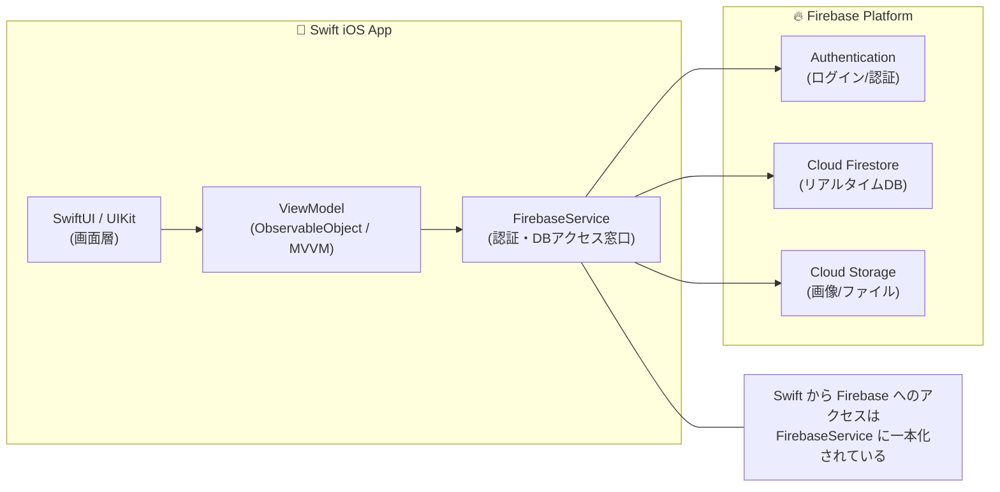

# Swift × Firebase リアルタイムメッセージングアプリまとめ

## 📘 目次
- [概要](#概要)
- [アーキテクチャ図（Mermaid）](#アーキテクチャ図mermaid)
- [外部引数と内部引数](#外部引数と内部引数)
  - [関数の定義](#関数の定義)
  - [引数の構造](#引数の構造)
  - [外部引数名と内部引数名](#外部引数名と内部引数名)
  - [関数の処理内容](#関数の処理内容)
  - [使用例](#使用例)
- [まとめ](#まとめ)

---

# 概要

昔作った **Swift + Firebase のリアルタイムチャットアプリ**を再整理し、  
Swift アプリ → Firebase へのアクセス構造や Swift の引数モデルをまとめたドキュメント。

---

# アーキテクチャ図（Mermaid）



---

# 外部引数と内部引数

Swift の引数には **外部引数名** と **内部引数名** が存在し、  
関数の使い方を分かりやすくするための仕組みになっている。

---

## 関数の定義

```swift
func greet(name: String) {
    print("Hello \(name)")
}
```

この関数は  
- `name` という文字列を受け取り  
- `"Hello {name}"` の挨拶文をコンソールに表示する。

---

## 引数の構造

### 🔹 `name: String`

Swift の引数は **外部引数名** と **内部引数名** の2つを持てる。

この場合はどちらも `name` になっている。

#### 呼び出し側（外部引数名）
```swift
greet(name: "Taiki")
```

#### 関数内部（内部引数名）
```swift
print("Hello \(name)")
```

---

## 外部引数名と内部引数名

完全な形式はこう：

```swift
func greet(name name: String)
```

- 左の `name` → 外部引数名  
- 右の `name` → 内部引数名  

両方同じなら省略してこう書ける：

```swift
func greet(name: String)
```

Swift はこれを推奨している。

---

## 関数の処理内容

```swift
print("Hello \(name)")
```

- 文字列補間を使って `name` を埋め込む  
- `"Hello ___"` の形式で出力する

---

## 使用例

```swift
greet(name: "Taiki")
```

出力：

```
Hello Taiki
```

---

# 🎯 まとめ

| 項目 | 内容 |
|------|------|
| 関数名 | `greet` |
| 引数 | `name: String` |
| 外部引数名 | `name` |
| 内部引数名 | `name` |
| 戻り値 | `Void` |
| 役割 | 挨拶文を出力する関数 |

---

